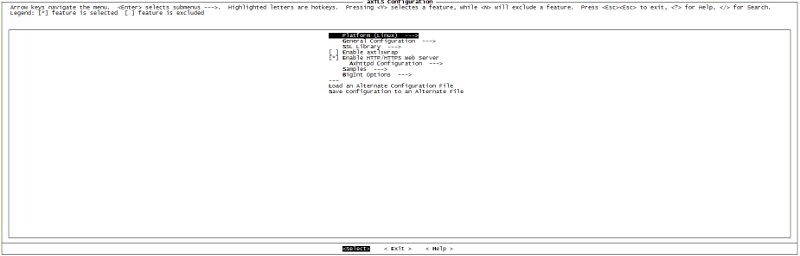

#axTLS
a highly configurable client/server TLSv1.1 SSL library designed for platforms with small memory requirements

[]()
[](https://raw.githubusercontent.com/Lembed/axTLS/master/LICENSE)
[]()
[]()

## Compilation

All platforms require GNU make. Configuration now uses a tool called "mconf" which gives a nice way to configure options 
(similar to what is used in BusyBox and the Linux kernel).

Select your platform type, save the configuration, exit, and then type "make" again.
To play with all the various axTLS options, type:
```bash
$ make menuconfig
```


Save the new configuration and rebuild.

Now you can type "make" to build it
```bash
$  make
```

## License
[BSD](https://github.com/Lembed/axTLS/blob/master/LICENSE)
